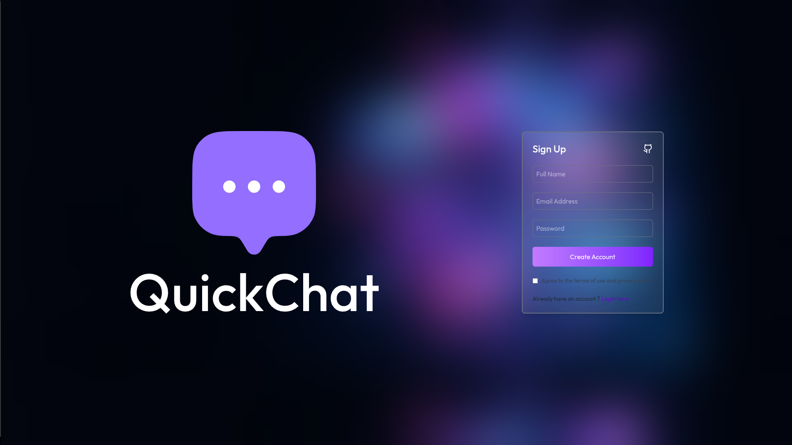
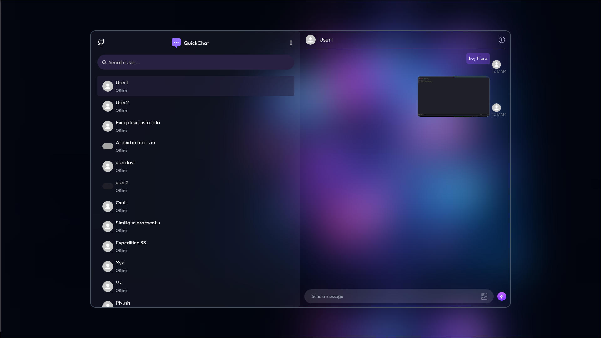
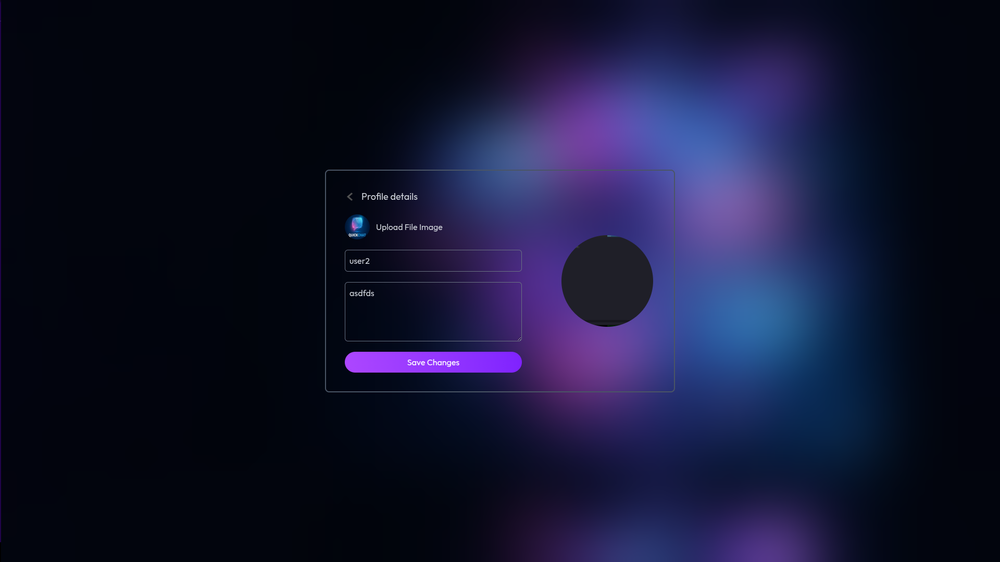

# QuickChat - Real-Time Chat Application

A modern, real-time chat application built with the MERN stack (MongoDB, Express.js, React, Node.js) and Socket.IO for instant messaging capabilities.

## 🚀 Features

- **Real-Time Messaging**: Instant message delivery using Socket.IO
- **User Authentication**: Secure login and registration system
- **User Profiles**: Customizable user profiles with avatars
- **Online Status**: See which users are currently online/offline
- **User Search**: Quickly find and connect with other users
- **Responsive Design**: Beautiful, modern UI that works on all devices
- **Message History**: Persistent chat history stored in MongoDB

## 🛠️ Tech Stack

### Frontend
- **React.js** - UI library
- **React Router** - Navigation
- **Context API** - State management
- **Socket.IO Client** - Real-time communication
- **CSS3** - Modern styling with gradients and animations

### Backend
- **Node.js** - Runtime environment
- **Express.js** - Web framework
- **MongoDB** - Database
- **Socket.IO** - WebSocket library
- **JWT** - Authentication
- **bcrypt** - Password hashing

## 📸 Screenshots

### Login Page

*Secure authentication with modern gradient design*

### Sign Up Page

*User registration with terms of service agreement*

### Chat Interface

*Real-time messaging with user list and online status indicators*

### Online Users

*Online users list with their status indicators*

### Profile Page

*User profile with their details and avatar*

## 🏃‍♂️ Getting Started

### Prerequisites
- Node.js (v14 or higher)
- MongoDB (local or Atlas)
- npm or yarn

### Installation

1. **Clone the repository**
   ```bash
   git clone https://github.com/Prasad-P2005/chat-app.git
   cd realtimechatapp
   ```

2. **Install server dependencies**
   ```bash
   cd server
   npm install
   ```

3. **Install client dependencies**
   ```bash
   cd ../client
   npm install
   ```

4. **Configure environment variables**
   
   Create a `.env` file in the `server` directory:
   ```env
   PORT=5000
   MONGODB_URI=your_mongodb_connection_string
   JWT_SECRET=your_jwt_secret_key
   ```

5. **Start the application**
   
   In the `server` directory:
   ```bash
   npm start
   ```
   
   In the `client` directory:
   ```bash
   npm run dev
   ```

6. **Access the application**
   
   Open your browser and navigate to `http://localhost:5173`

## 📁 Project Structure

```
realtimechatapp/
├── client/                 # React frontend
│   ├── src/
│   │   ├── components/    # Reusable components
│   │   ├── context/       # Context API (AuthContext)
│   │   ├── pages/         # Page components (Login, Profile, etc.)
│   │   └── App.jsx        # Main app component
│   └── package.json
│
├── server/                # Node.js backend
│   ├── models/           # MongoDB models
│   ├── routes/           # API routes
│   ├── middleware/       # Custom middleware
│   ├── socket/           # Socket.IO configuration
│   ├── server.js         # Entry point
│   └── package.json
│
└── screenshots/          # Application screenshots
```

## 🔑 Key Features Explained

### Real-Time Communication
The application uses Socket.IO to establish WebSocket connections between clients and the server, enabling instant message delivery without polling.

### Authentication & Security
- Passwords are hashed using bcrypt before storage
- JWT tokens are used for session management
- Protected routes ensure only authenticated users can access chat features

### User Experience
- Modern gradient UI with smooth animations
- Responsive design for mobile and desktop
- Online/offline status indicators
- Search functionality for finding users quickly

## 🚀 Deployment

### Frontend (Vercel)
The client is configured for Vercel deployment with `vercel.json`.

### Backend (Render/Railway)
Deploy the server to platforms like Render or Railway with environment variables configured.

## 🤝 Contributing

Contributions are welcome! Please feel free to submit a Pull Request.

## 📝 License

This project is open source and available under the [MIT License](LICENSE).

## 👨‍💻 Author

**Prasad P**
- GitHub: [@Prasad-P2005](https://github.com/Prasad-P2005)

## 🙏 Acknowledgments

- Socket.IO for real-time communication
- MongoDB for database solutions
- React community for excellent documentation

---

**Note**: Make sure to add your actual screenshots to the `screenshots/` directory with the following names:
- `chat-interface.png`
- `welcome-screen.png`
- `login-page.png`
- `signup-page.png`
